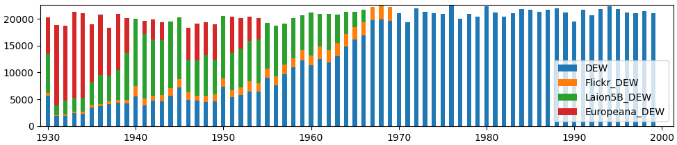
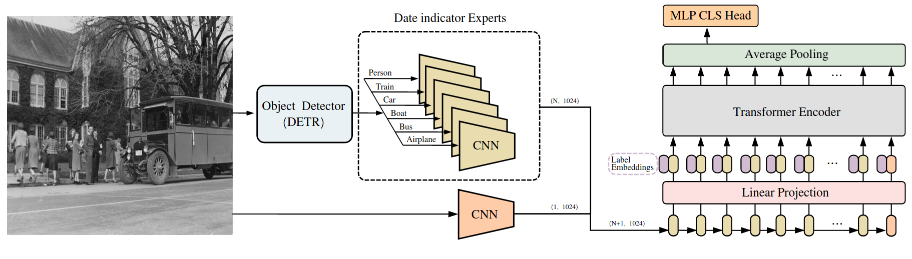
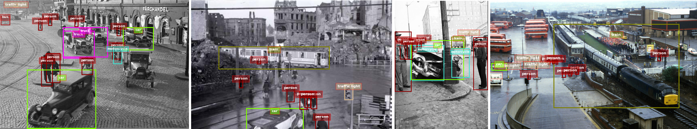
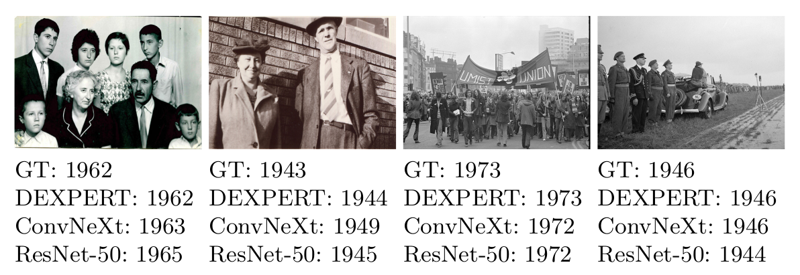

# DEXPERT

[[Paper]](https://todo) [[Citations]](#citing)

(Work in progress!) 

This repo provides the dataset, code, and models' weights for the paper "A Transformer-based object-centric approach for date estimation of historical photographs", published in the 46th European Conference on Information Retrieval, [ECIR 2024](https://www.ecir2024.org/).

The main contribution of this work are:
- An ampliation of the [DEW dataset](https://www.radar-service.eu/radar/en/dataset/tJzxrsYUkvPklBOw), balancing the data distribution, called **DEW-B** (Date estimation in the Wild - Balanced)
- Creation of a new model, **DEXPERT**, that combines object detection, CNN's and a Transformer encoder to estimate the date of historical photographs.
- Results for the DEW and DEW-B datasets using the DEXPERT model and other baselines.

Some of our best models are shown below (evaluated in DEW test set):

| **Method**                                                                                                | **Training data** | **Mean average error (MAE)** |
|-----------------------------------------------------------------------------------------------------------|-------------------|------------------------------|
| [Müller et al. ResNet50](https://link.springer.com/chapter/10.1007/978-3-319-56608-5_57) (classification) | DEW               | 7.12                         |
| ConvNext-Base (WCE)                                                                                       | DEW               | 4.75                         |
| DEXPERT                                                                                                   | DEW               | 4.55                         |
|                                                                                                           |                   |                              |
| ResNet50 (classification)                                                                                 | DEW-B             | 5.72                         |
| ConvNext-Base                                                                                             | DEW-B             | 4.10                         |
| DEXPERT                                                                                                   | DEW-B             | 4.46                         |


## DEW-B Dataset

The DEW-B dataset, aims to provide more training images for the years that are less represented in the [DEW dataset](https://www.radar-service.eu/radar/en/dataset/tJzxrsYUkvPklBOw), from 1930 to 1969. The contributed training data has been harvested from three sources: the [LAION-5B dataset](https://laion.ai/blog/laion-5b/), and the [Flickr](https://www.flickr.com/) and [Europeana](https://www.europeana.eu/es) web portals. In the following image we can see the number of training images per year in the DEW-B dataset. The original DEW dataset (blue bars in the plot) was highly unbalanced, with the number of images drastically decreasing with the age of the data. Our contributed data (Flickr DEW,  Laion5B DEW, and Europeana DEW) provide more training images for the less represented years:



### Images URLs and annotation files (TBD)


## DEXPERT Model

The proposed DEXPERT model consists of an object detector, an ensemble of Convolutional Neural Network (CNNs) experts, and a Transformer encoder that aggregates the information from the different experts to generate a final prediction.



### Object detection module

These files are used to train the specialists models and then the DEXPERT. By specifying the path to the DEW / DEW-B dataset and the folder name, detections will be computed and saved in the specified folder:
```
python detr_inference.py --path_to_db <path_to_db> --folder_name <folder_name> 
```
[DETR model (ResNet50)](https://huggingface.co/facebook/detr-resnet-50) is used to extract the detections. Other backbones can be used by editing the `--model_name` parameter. 
Otherwise, **detections** can be also **downloaded** [here](https://todo).



### Date Indicator Experts & Global CNN Expert
In order to train the date indicator experts or the global CNN, the following command must be executed:
```
python train.py --data-path <data_path> --model convnext_base --batch-size <batch_size> --opt adamw --lr 1e-5 --lr-scheduler cosineannealinglr --auto-augment ta_wide --epochs 70 --weight-decay 0.05 --norm-weight-decay 0.0 --train-crop-size 176 --val-resize-size 232 --ra-sampler --weights ConvNeXt_Base_Weights.DEFAULT --specialist <specialist> --resume <resume> --balanced 
```
- `<specialist>`: represents which date indicator expert you are training `Person`, `Train`, `Car`, `Boat`, `Bus`, `Airplane` or `None` (global).
- `<data_path>`: where the dataset is located.
- `<balanced>`: if the dataset is DEW-B, this flag must be specified, else, it must be omitted.
- `<resume>`: if you want to resume the training from a checkpoint, you must specify the path to the checkpoint, else, it must be omitted. In this case, in the paper we have trained first the global CNN and then the date indicator experts.

The other parameters are optional and can be modified, but the ones specified in the command are the ones used in the paper.
If you want to **download** the **weights** of the experts, you can do it [here](https://todo).

### DEXPERT
The DEXPERT module uses the pretrained Date Indicator Experts and Global CNN to train the Transformer encoder. In order to train the DEXPERT, the commands that were specified in the previous section must be executed first or the weights must be downloaded. Then, in order to train the DEXPERT module the following command must be executed:
```
python train_DEXPERT.py train_DEXPERT.py --data-path <data_path> --model convnext_base --batch-size <batch_size> --opt adamw --lr 1e-3 --lr-scheduler cosineannealinglr --auto-augment ta_wide --epochs 50 --weight-decay 0.05 --norm-weight-decay 0.0 --ra-sampler --balanced
```
- `<data_path>`: where the dataset is located.
- `<balanced>`: if the dataset is DEW-B, this flag must be specified, else, it must be omitted.

The other parameters are optional and can be modified, but the ones specified in the command are the ones used in the paper.
If you want to **download** the **weights** of the DEXPERT model, you can do it [here](https://todo).


## Evaluation
To evaluate from a checkpoint (either a fine-tuned model or our pretrained models), the following command must be executed:
```
python <py_file.py> --data-path <data_path> --model convnext_base --batch-size <batch_size> --train-crop-size 176 --val-resize-size 232 --resume <resume> --balanced 
```
- `<py_file.py>`: the file to evaluate (`train_DEXPERT.py` for DEXPERT model or `train.py` for others).
- `<resume>`: checkpoint path.


## Qualitative samples
Some qualitative samples of the DEXPERT model absolute error ∈ {0, 3} are shown below:




## Acknowledgements
This work has been supported by the Ramon y Cajal research fellowship RYC2020-
030777-I / AEI / 10.13039/501100011033, the CERCA Programme / Generalitat de
Catalunya, and ACCIO INNOTEC 2021 project Coeli-IA (ACE034/21/000084).


## Citing 
If you found this repository useful, please consider citing:
```
@inproceedings{net2017dexpert,
  title={A Transformer-based object-centric approach for date estimation of historical photographs},
  author={Net, Francesc and Hernández, Núria and Molina, Adrià and Gomez, Lluis},
  booktitle={46th European Conference on Information Retrieval, ECIR 2024},
  year={2024},
  organization={Springer}
}
```


