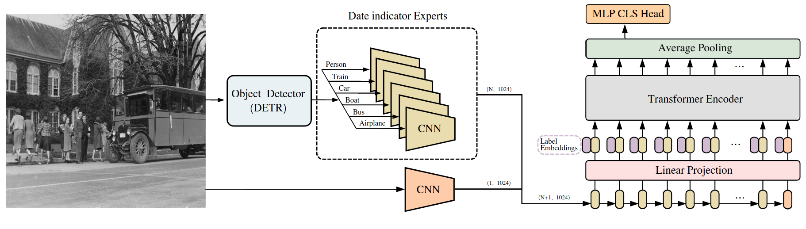

# DEXPERT

TBD

This repo provides the dataset, code, and models' weights for the paper "A Transformer-based object-centric approach for date estimation of historical photographs".

```
@inproceedings{net2017dexpert,
  title={A Transformer-based object-centric approach for date estimation of historical photographs},
  author={Net, Francesc and Hernández, Núria and Molina, Adrià and Gomez, Lluis},
  booktitle={46th European Conference on Information Retrieval, ECIR 2024},
  year={2024},
  organization={Springer}
}
```

## DEW-B Dataset

TBD

## DEXPERT Model

The proposed DEXPERT model consists of an object detector, an ensemble of Convolutional Neural Network (CNNs) experts, and a Transformer encoder that aggregates the information from the different experts to generate a final prediction.



Code and pre-trained weights (TDB)
